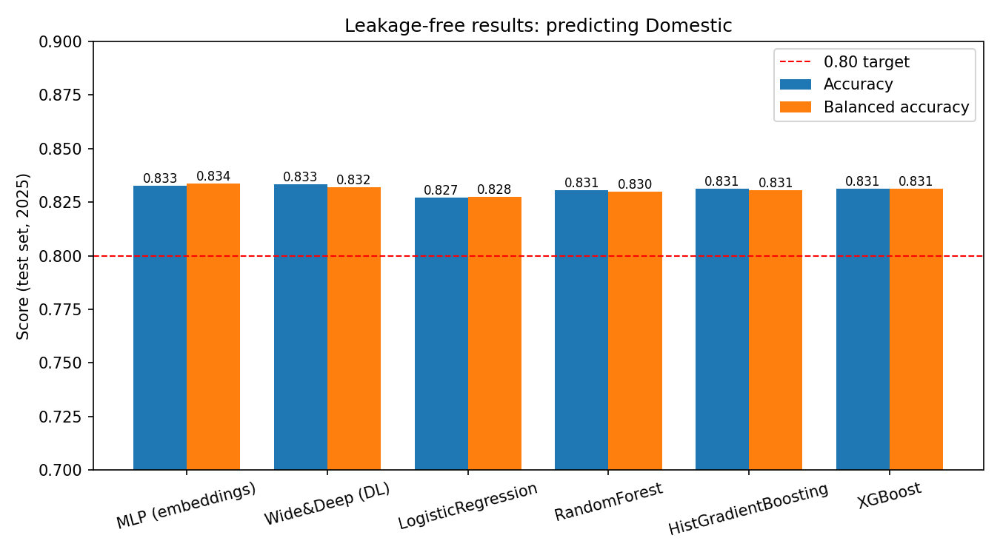

# Chicago Crime: Predicting Domestic Incidents (Leakage-Free)

A capstone project that predicts whether a reported Chicago crime is **Domestic** (`Domestic = True/False`) using only three features, with a strict time-based split so no future information leaks into training.

Four classical ML models and two deep learning models are compared. The best reach about **83% accuracy** and **0.91 ROC-AUC** on a held-out test set (all of 2025).

---

## Key Ideas

- **Leakage audit.** Columns that leak the answer or the future are excluded: `Description` (literally contains "DOMESTIC ..."), `IUCR`, `FBI Code`, `Block`, `Updated On`, IDs, duplicate coordinate columns, `Year`, and the other label (`Arrest`).
- **Chronological split** (no random shuffling):

  | Split | Period |
  |---|---|
  | Train | 2023 to Jun 2024 |
  | Validation | Jul to Dec 2024 |
  | Test | All of 2025 (236,927 rows) |

- **Feature selection on train/validation only.** Mutual information (filter) followed by greedy forward selection scored by validation ROC-AUC.
- **Encoders live inside pipelines**, so they are fitted on training data only.
- **Decision threshold is tuned on validation**, never on test. It maximizes `min(accuracy, balanced accuracy)`.
- **Leakage sanity check.** With shuffled labels, the pipeline's test AUC drops to about 0.5, as it should.

---

## Feature Selection

The final feature set is **Primary Type + Location Description + Beat**. The evidence is in `reports/`.

### Mutual information (`reports/mutual_info_domestic.csv`)

Higher means the feature tells you more about the target on its own.

| Feature | Mutual information |
|---|---|
| Primary Type | 0.1340 |
| Location Description | 0.1014 |
| Longitude | 0.0855 |
| Latitude | 0.0854 |
| Beat | 0.0252 |
| Community Area | 0.0209 |
| Ward | 0.0182 |
| District | 0.0181 |
| IsWeekend | 0.0150 |
| DayOfWeek | 0.0085 |
| Hour | 0.0059 |
| Month | 0.0048 |
| LatLon_Missing | 0.0004 |

Mutual information scores each feature separately. It cannot see that latitude, longitude, and Beat carry overlapping information, which is why a second step is needed.

### Forward selection (`reports/feature_selection_domestic.csv`)

Features are added one at a time, each time choosing the one that raises validation ROC-AUC the most. The search stops when a new feature adds less than 0.003 AUC.

| Step | Feature added | Validation AUC |
|---|---|---|
| 1 | Primary Type | 0.8457 |
| 2 | Location Description | 0.9121 |
| 3 | Beat | 0.9178 |

---

## Models

| Model | Type | Encoding |
|---|---|---|
| Logistic Regression | ML | One-hot |
| Random Forest | ML | Target encoding |
| HistGradientBoosting | ML | Target encoding |
| XGBoost | ML | One-hot |
| MLP (embeddings) | DL (PyTorch) | Learned embeddings |
| Wide & Deep | DL (PyTorch) | Wide embeddings plus deep residual network |

---

## Results (test set = all of 2025)

| Model | Threshold | Accuracy | Balanced Acc. | Precision | Recall | F1 | ROC-AUC |
|---|---|---|---|---|---|---|---|
| MLP (embeddings) | 0.57 | 0.8327 | 0.8336 | 0.5397 | 0.8350 | 0.6556 | 0.9136 |
| Wide&Deep (DL) | 0.58 | 0.8332 | 0.8320 | 0.5408 | 0.8301 | 0.6549 | 0.9127 |
| LogisticRegression | 0.53 | 0.8271 | 0.8276 | 0.5299 | 0.8285 | 0.6463 | 0.9094 |
| RandomForest | 0.51 | 0.8305 | 0.8299 | 0.5359 | 0.8290 | 0.6510 | 0.9103 |
| HistGradientBoosting | 0.55 | 0.8313 | 0.8306 | 0.5373 | 0.8294 | 0.6521 | 0.9114 |
| XGBoost | 0.52 | 0.8312 | 0.8311 | 0.5371 | 0.8309 | 0.6524 | 0.9125 |



All six models clear the 0.80 target and land within about 0.6 percentage points of each other. That the simple Logistic Regression is close to the deep models suggests the three features carry most of the signal, so model choice matters less than feature choice and a leak-free setup.

The full table is saved in `outputs/leakfree_results.csv`.

---

## Project Structure

```
capstone project/
├── build_dataset.py        # Step 1: clean data, leakage audit, split, feature selection
├── data_utils.py           # Shared helpers: loading splits, threshold, metrics, results table
├── ml_models.py            # Step 2: trains the 4 classical ML models -> models/*.joblib
├── dl_model.py             # Step 3a: MLP with embeddings (PyTorch)
├── dl_model2.py            # Step 3b: Wide & Deep network (PyTorch)
├── evaluate_ml.py          # Step 4: final results table + chart
├── requirements.txt
├── data/
│   ├── raw/                # Chicago crimes CSV (not in the repo, see Data)
│   └── processed/          # chicago_domestic_minimal.csv
├── models/                 # Saved ML pipelines (not in the repo, regenerate)
├── notebooks/              # EDA, feature selection, and experiments
├── outputs/                # Results CSV, accuracy chart, EDA graphs
├── reports/                # Mutual information and feature selection CSVs
└── src/                    # Early helper modules for loading, cleaning, analysis, plots
```

---

## Setup

Python 3.11 is recommended.

```bash
pip install -r requirements.txt
```

`requirements.txt`:

```
numpy
pandas
scikit-learn
matplotlib
seaborn
xgboost
torch
joblib
```

Use `scikit-learn >= 1.3`, because `TargetEncoder` was added in that version. For exact reproducibility, pin the versions you used (run `pip freeze` and copy the lines for these packages), since saved `.joblib` files can break across library versions.

## Data

Download **Crimes - 2001 to Present** from the [Chicago Data Portal](https://data.cityofchicago.org/) and save it as:

```
data/raw/Crimes_-_2001_to_Present_20260902.csv
```

The raw file is too large for GitHub, so it is not included in this repository.

---

## How to Run

Run from the project folder. Create the output folders once if they don't exist:

```bash
mkdir models reports outputs data/processed
```

```bash
python build_dataset.py     # 1. raw data -> data/processed/chicago_domestic_minimal.csv
python ml_models.py         # 2. trains 4 ML models, saves them to models/
python dl_model.py          # 3a. trains the MLP, adds its row to outputs/leakfree_results.csv
python dl_model2.py         # 3b. trains Wide & Deep, adds its row to the same file
python evaluate_ml.py       # 4. final table + outputs/leakfree_accuracy_chart.png
```

Notes:

- `data_utils.py` is imported by the other scripts. You don't run it directly.
- `evaluate_ml.py` reloads the four saved ML models and recomputes their rows. The DL rows come from `outputs/leakfree_results.csv`, so run both DL scripts before `evaluate_ml.py`.
- `build_dataset.py` accepts `--target Domestic` (default) or `--target Arrest`. The downstream scripts are set up for `Domestic`.
- Trained models are **not included** in the repository because of file size (Random Forest is over 100 MB). Run `python ml_models.py` to regenerate them in `models/`.

---

## Notebooks

| Notebook | Purpose |
|---|---|
| `crime_analysis_EDA.ipynb`, `crime_analysis.ipynb` | Exploratory data analysis. Graphs are saved in `outputs/EDA_graphs/`. |
| `Base_Models.ipynb`, `Chicago_Crime_Base_Models.ipynb` | Early baseline models. Results in `outputs/base_model_results.csv`. |
| `02_Crime_Feature_Selection.ipynb` | Feature selection experiments. |
| `03_Leakage_Safe_Cluster_Feature_Selection.ipynb` | Leakage-safe, cluster-based feature selection. |
| `04_Chicago_Selected_Feature_Models.ipynb` | Models trained on the selected features. |
| `Chicago_Crime_5ML_2DL_Balanced.ipynb`, `Chicago_Crime_Clean_ML_DL.ipynb` | ML and DL comparison experiments with class balancing. |
| `fixed_code.ipynb` | Corrected version of earlier code. |

The final, leak-free results come from the Python scripts above, not from the early notebooks. `outputs/final_model_comparison.csv` holds earlier comparison results.

---

## Author

**P. Aravinda Valli**
